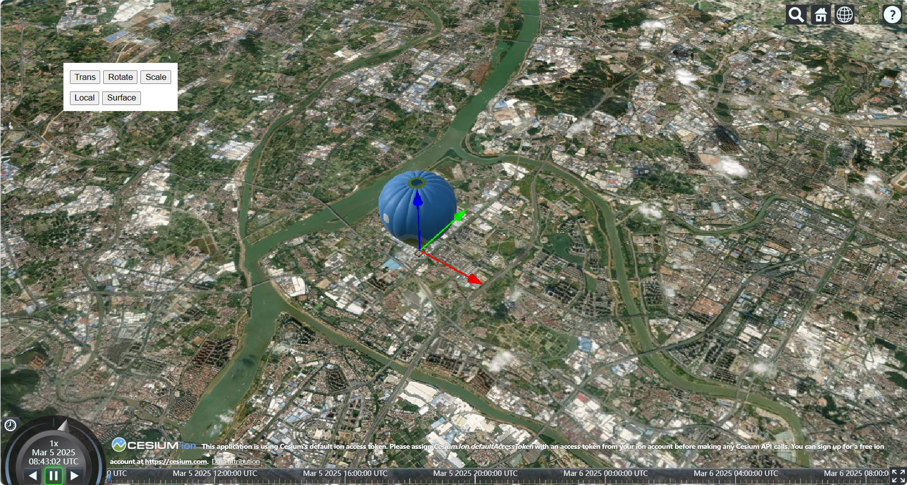

# cesium-gizmo

A Simple Cesium Gizmo using Cesium's Public API.

> Under development.

There're three mode: translate, rotate, scale. And the translate mode has two sub-modes: local and surface.

- local: XYZ coordinates of a freely moving object.
- surface: moves along the latitude and longitude lines of the ellipsoid's surface.

Thanks to the amazing job from [cesium-gizmo](https://www.github.com/zhwy/cesium-gizmo) and [three.js](https://github.com/mrdoob/three.js) TransformControls

## 中文

一个使用Cesium公共API的简易Gizmo

有三种模式：平移，旋转，缩放。平移有两种子模式：local 和 surface

- local：自由移动物体的XYZ坐标
- surface：沿地球表面经纬线移动

## Usage

```sh
npm install cesium-gizmo
```

```javascript
import { Gizmo } from "cesium-gizmo";
const gizmo = new Gizmo();

gizmo.attach(viewer);
```



## Development

This repository contains an example in index.html.

```sh
npm install
npm run dev
```

For the built, production version

```sh
npm run build
```

## Available scripts

- `npm run eslint` - Lint this project
- `npm run prettier` - Format all the code to a consistent style
- `npm run prettier-check` - Check the format of code but do not change it
- `npm run dev` - Starts the Vite development server server at `localhost:5173`
- `npm run build` - Runs the Vite production build

## Thanks

[cesium-gizmo](https://www.github.com/zhwy/cesium-gizmo)

[cesium-vite-example](https://github.com/CesiumGS/cesium-vite-example)

[教程 - 在 Vue3+Ts 中引入 CesiumJS 的最佳实践@2023](https://juejin.cn/post/7219674355491340348)
